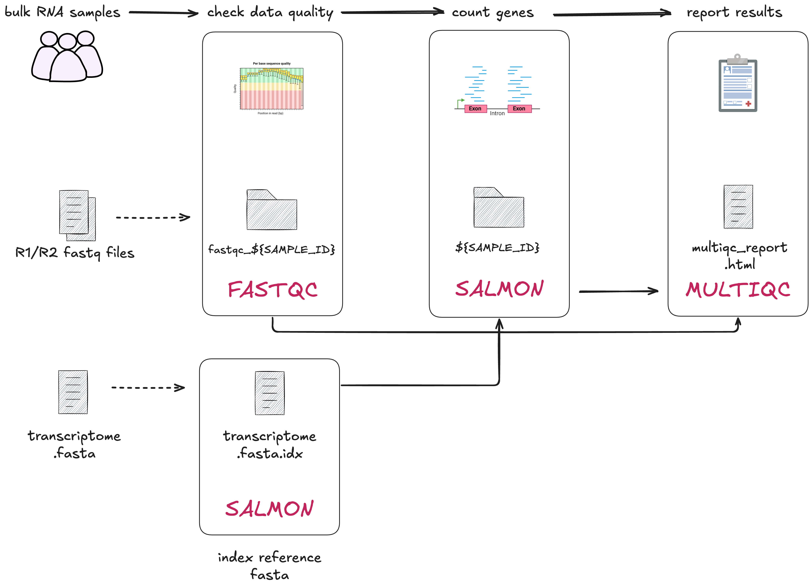

# 2.0 Introduction  

Part 2 builds on fundamental concepts learned in Part 1 and provides you with 
hands-on experience in Nextflow workflow development. Throughout the session 
we will be working with a bulk RNAseq dataset to build our workflow. 

We will construct **channels** that control how our data flows through 
**processes** that we will progressively construct to build our **workflow**. 
Each lesson in Part 2 will build on the previous lessons, so you can gain a 
deeper understanding of the techniques and the impact they have on your 
resulting workflow. 

In Part 2 of this workshop, we will explore a scenario of create a multi-sample 
Nextflow workflow for preparing RNAseq data. We will build the workflow, 
step-by-step, by converting a series of provided bash scripts into small workflow 
components.  

Along the way, you will encounter Nextflow concepts (from yesterday, and some
new) and our best practice recommendations for developing your own pipeline.  

## 2.0.1 Log back into your instance 

Follow set up instructions to log back into your instance.
  > Add link to set up instructions   
  > Add some instruction on how to do this and where to navigate for day 2.

## 2.0.2 Our scenario: from bash scripts to scalable workflows  

Imagine you are a bioinformatician in a busy research lab. Your team will be
receiving a large batch of samples that need to be processed through a series
of analysis steps.  

You have inherited a set of bash scripts from a former colleague, which were
used to process a handful of samples manually. These scripts are robust
and well-tested, but they were not designed with scalability in mind.  

As more samples come in, running these scripts one by one is becoming
increasingly tedious and error-prone.  

**You need a way to automate this process, ensuring consistency and efficiency
across many samples.** 

You decide to use Nextflow.  

Take a look at the scripts your colleague provided: 

```bash title="navigate to the bash scripts" 
cd ~/hello-nextflow/day2/data/bash-scripts
```

Note the different scripts in this directory: 

* Task level scripts runs individual data processing steps of the workflow. One script per process. 
* `single_sample.sh` runs each script over one sample, sample name is provided as an argument for some scripts
* `multi_sample.sh` runs each script within a loop 

!!! question "Exercise: examine the bash scripts"

    What are some limitations of these scripts in terms of workflow execution and monitoring? 
    
    ??? note "Solution"
        * No parallelism: processes run iteratively, increasing overall runtime and limiting scalability. 
        * No error handling: if a step fails, may propagate errors or incomplete results into subsequent steps. 
        * Something about cache/dependency tracking 
        * No resource management: inefficient resource usage, no guarantee processes are able to access the CPU, RAM, disk space they need. 
        * No software management: assumes same environment is available every time it is run.   

## 2.0.3 Our workflow: RNAseq data processing 

!!! danger "Don't worry if you don't have prior knowledge of RNAseq"

    The focus of this workshop is on learning Nextflow, the RNAseq data we 
    are using in this part are just a practical example to help you understand 
    how the workflow system works. 

RNAseq is used to study gene expression and has many applications across
biomedicine, agriculture and evolutionary studies. In our scenario we are going to 
run through some basic core steps that allow us to explore different aspects of 
Nextflow. 

**Data**  

The data we will use includes:
- `*.fastq`: Paired-end RNAseq reads from three different samples (gut, liver,
lung)
- `transcriptome.fa`  

**Tools**  

We will be implementing and integrating three commonly used bioinformatics
tools:  
1. [Salmon](https://combine-lab.github.io/salmon/) is a tool for quantifying molecules known as transcripts through RNA-seq data.  
2. [FastQC](https://www.bioinformatics.babraham.ac.uk/projects/fastqc/) is a tool for quality analysis of high throughput sequence data. You can think of it as a way to assess the quality of your data.  
3. [MultiQC](https://multiqc.info/) searches a given directory for analysis logs and compiles an HTML report for easy viewing. It's a general use tool, perfect for summarising the output from numerous bioinformatics tools.  

These tools will be run using Docker containers. We will not explore how the
data and tools work further, and focus on how they should be implemented in a
Nextflow workflow.  

## 2.0.4 Pipeline structure and design 

Having reviewed the bash scripts, we've decided to keep its modular structure and will build the following four processes (discrete steps):

1. `INDEX` - Transcriptome indexing (tool: [Salmon](https://combine-lab.github.io/salmon/)): create an index of the reference transcriptome for faster and efficient data processing.
2. `FASTQC` - Raw data quality control (tool: [FastQC](https://www.bioinformatics.babraham.ac.uk/projects/fastqc/)): assess the quality of fastq files to ensure our data is usable. 
3. `QUANTIFICATION` - Gene quantification (tool: [Salmon](https://combine-lab.github.io/salmon/)): counting how many reads map to each gene in the transcriptome. 
4. `MULTIQC` - Summarise results in a report (tool: [MultiQC](https://multiqc.info/)): generate a report that summarises quality control and gene quantification results. 
  


## 2.0.5 Nextflowing the workflow

Each lesson in part 2 of our workshop focuses on implementing one process of 
the workflow at a time. We will iteratively build the workflow and processes 
in a single `main.nf` file and lightly use a `nextflow.config` file for configuration.


### `main.nf`

Most of the code written for this part of the workflow will be focused on the 
`main.nf` script. We will follow an ordered approach for each step of the workflow 
building off the `process` structure from Section 1.2. You will be using this 
process template for each step of the workflow, adding them to the top of the 
`main.nf` script: 

```groovy
process < name > {
  [ directives ]

  input:
    < process inputs >

  output:
    < process outputs >

  script:
  """
  < script to be executed >
  """
}
```

Drawing upon the bash scripts for each step of the workflow, the definitions will
be completed in the following order:  

> Note: not sure this is exectly what we should follow for every process. Some are better suited than others. 

1. `script`
2. `output`
3. `input`
4. `directives`
5. Adding to the `workflow` scope, any `params` and channels required  

### `nextflow.config`

This script will intermittently be used in the following lessons. 
> Note: Add a short explainer of what config will be used for. 

