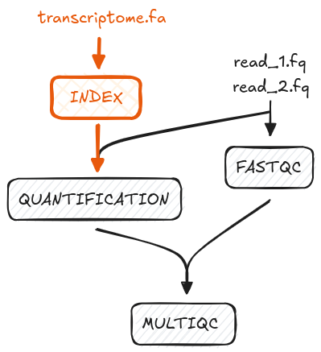

# 2.1 Implementing a simple process with Docker  

!!! note "Learning objectives"

    1. Implement a Nextflow process that takes a single file as input.  
    2. Understand why Docker containers are used for each process.  
    3. Store output files with the `publishDir` directive.  

In this step we will implement `00_index.sh` as a Nextflow process called
`INDEX`. 



```bash title="00_index.sh"
mkdir "results"
salmon index --transcripts data/ggal/transcriptome.fa --index results/salmon_index
```

- The script first creates a `results/` folder then runs `salmon index`.  
- The `--transcripts` flag indicates that the path to the input transcriptome
file is (`data/ggal/transcriptome.fa`).  
- `--index results/salmon_index` tells `salmon` to save the output index files in a directory called `salmon_index`, within the newly created `results` directory.  

> Note about hardcoded arguments and output directory, and how this is
addressed in Nextflow  

This is enough information to construct the process.  

## 2.1.1 Adding the `INDEX` process

In the empty `main.nf` script, add the following `process` scaffold with the
script definition:  

```groovy title="main.nf"
process INDEX {
  [ directives ]

  input:
    < process inputs >

  output:
    < process outputs >

  script:
  """
  salmon index --transcripts $transcriptome --index salmon_index
  """
}
```

> Note about $transcriptome

Next we will add the `input` and `output` definitions. 

The qualifiers will be `path` for both as they are either a file or directory.
The values are obtained from `--transcripts $transcriptome` and
`--index salmon_index` respectively.

> Needs better, slower, explanation.  

```groovy title="main.nf"
process INDEX {
  [ directives ]

  input:
  path transcriptome

  output:
  path 'salmon_index'

  script:
  """
  salmon index --transcripts $transcriptome --index salmon_index
  """
}
```

Note that the input `path transcriptome` is a variable and the output `path
'salmon_index' is fixed.  

> Add your own comment 

## 2.1.2 Save files to an output directory with `publishDir`  

Next we will implement the Nextflow equivalent of saving the output files into a
`results/` directory.  

Add the following `publishDir` directive:  

```groovy title="main.nf"
process INDEX {

  publishDir "results", mode: 'copy'

  input:
  path transcriptome

  output:
  path 'salmon_index'

  script:
  """
  salmon index --transcripts $transcriptome --index salmon_index
  """
}
```

This process is now directed to copy all output files into a `results/`
directory. This saves having to specify the output directory in the script
definition each process, or a tedious `mv salmon_index/ results/` step. 
Nextflow also handles whether the directory already exists or if it
should be created. 

More information and other modes can be found on
[publishDir](https://www.nextflow.io/docs/latest/process.html#publishdir).

> in the bash script you had to manually `mkdir -p "results`

## 2.1.3 Using Docker containers  

Nextflow has support for managing the execution of processes in software
containers. This is useful when you need to execute a process that requires a
specific software version. Using containers also helps with the portability of
workflows, for example, when you have to execute the workflow on an HPC cluster
on many samples.  

Add the following container directive to `INDEX`:  

```groovy title="main.nf"
process INDEX {

    container "quay.io/biocontainers/salmon:1.10.1--h7e5ed60_0"
    publishDir "results" mode: 'copy'

    input:
```

Usually, containers need to be downloaded using a command such as
`docker pull [image]`. All containers have been previously downloaded for the
workshop beforehand.  

> Why one container per process?  

Next, we need to configure Nextflow to use Docker. Create a `nextflow.config`
file in the same directory as `main.nf` and add the following:  

```groovy linenums="1" title="nextflow.config"
docker.enabled = true
```

You now have a complete process! 

A Nextflow process is similar to a function definition in R or Python. We have
the instructions of what to do, and now need to call the function and pass in
the inputs for it to run.

## 2.1.4 Adding `params` and the workflow scope  

In the bash script, the file `data/ggal/transcriptome.fa` was passed as the
input into `salmon index`.

We will pass in this file path as a `params`. Add the following to the top of your `main.nf` script:  

```groovy title="main.nf"
/*
 * pipeline input parameters
 */
params.transcriptome_file = "$projectDir/data/ggal/transcriptome.fa"
```

Recall that parameters are inputs and options that can be modified when the
workflow is executed.  

We define it in the `main.nf` script instead of in a command with `--` double
hyphen as the file (path) will not change.

[`$projectDir`](https://www.nextflow.io/docs/latest/script.html#configuration-implicit-variables)
is a configuration implicit variable that indicates the directory of the
`main.nf` script. 

Next, add the workflow scope:  

```groovy title="main.nf"
workflow {
    index_ch = INDEX(params.transcriptome_file)
}
```

This will tell Nextflow to run the `INDEX` process with
`params.transcriptome_file` as input, and forward the output to a channel
called `index_ch`.

> Probably add a note about the difference between `publishDir` and `index_ch`.
Refer to diagram.  

We are now ready to run our workflow!  

## 2.1.5 Running the workflow  

In the terminal, run the command:  

```bash
nextflow run main.nf
``` 

Your output should look something like:  

```console title="Output"
N E X T F L O W   ~  version 24.04.4

Launching `main.nf` [chaotic_jones] DSL2 - revision: 6597720332

executor >  local (1)
[de/fef8c4] INDEX | 1 of 1 ✔
```

Recall that the specifics of the output are randomly generated (i.e.
`[chaotic_jones]` and `[de/fef8c4]` in this example).

In this example, the output files for the `INDEX` process is output in
`work/26/c410b1...`.

> Inspect results folder?  

> results/salmon_index has a bunch of different files

!!! question "Exercise"

    Inspect the `.command.sh` file and compare it with `00_index.sh`. Note the
    similarities and differences.  

You have successfully run your first workflow!  

!!! abstract "Summary"

    In this step you have learned:  

    1. How to implement a simple process with input data  
    2. How to define parameters in your workflow scripts and the command
    line
    3. How to use a Docker container for a process  
    4. How to output files in a dedicated `publishDir`  
