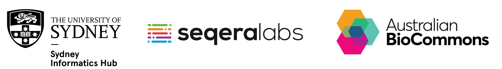

# Hello Nextflow workshop 

This workshop will provide you with the foundational knowledge required to build Nextflow workflows. The content is broken up into 2 parts. In the first part we will cover the basic principles for developing Nextflow pipelines. In the second part we will step through building our own Nextflow workflow. See the lesson plan for details.

## Trainers
* Fred Jaya, Sydney Informatics Hub, University of Sydney
* Georgie Samaha, Sydney Informatics Hub, University of Sydney
* Chris Hakkaart, Seqera

## Prerequisites

This is an intermediate-advanced workshop for people developing reproducible bioinformatics workflows.

* Experience working on the command line/Linux environment.
* Experience developing reproducible workflows (e.g., bash, CWL, WDL, or Snakemake). 

## Set up requirements

Please complete the [Setup](setup.md) instruction before the workshop. If you have any trouble, please get in contact with us ASAP via Slack.

## Code of Conduct
In order to foster a positive and professional learning environment we encourage the following kinds of behaviours at all our events and on our platforms:

* Use welcoming and inclusive language
* Be respectful of different viewpoints and experiences
* Gracefully accept constructive criticism
* Focus on what is best for the community
* Show courtesy and respect towards other community members
* Our full code of conduct, with incident reporting guidelines, is available here.

## Workshop schedule  

### Day 1

|Time (AEST)|Activity                            |Presenter(s)  |
|-----------|------------------------------------|--------------|
|14:00      |Welcome                             |Melissa       |
|14:10      |Introduction to the workshop        |Georgie       |
|14:15      |Workspace set up                    |Georgie       |
|14:20      |Introduction to Nextflow and nf-core|Chris         |
|14:30      |Workshop: Part 1.0 - 1.4            |Chris         |
|15:30      |BREAK                               |Melissa       |
|15:45      |Workshop: Part 1.5 - 1.8            |Chris         |
|16:45      |Q&A and Day 1 recap                 |Chris, Melissa|

### Day 2

|Time (AEST)|Activity                            |Presenter(s)  |
|-----------|------------------------------------|--------------|
|14:00      |Day 2 Welcome                       |Melissa       |
|14:05      |Setup and Introduction to Part 2    |Fred          |
|14:15      |Workshop: Part 2.1 - 2.3            |Fred          |
|15:30      |BREAK                               |Melissa       |
|15:45      |Workshop: Part 2.4 - 2.5            |Fred          |
|16:40      |Day 2 Summary                       |Georgie       |
|16:50      |Wrap up and survey                  |Melissa       |

## Course survey

Please fill out our [course survey](https://www.surveymonkey.com/r/nextflow-2024)
at the end of the workshop. Help us help you! 😁

## Credits and acknowledgements

This workshop event and accompanying materials were developed by the Sydney Informatics Hub, University of Sydney in partnership with Seqera. The workshop was enabled through the Australian BioCommons - [BioCLI Platforms Project](https://www.biocommons.org.au/biocli) (NCRIS via Bioplatforms Australia). 

