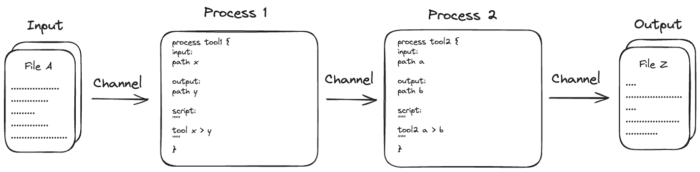

# Why Nextflow?

Nextflow is a **workflow orchestration engine and domain-specific language (DSL)** that makes it easy to write data-intensive computational workflows.

It is designed around the idea that the Linux platform is the lingua franca of data science. Linux provides many simple but powerful command-line and scripting tools that, when chained together, facilitate complex data manipulations.

Nextflow extends this approach, adding the ability to define complex program interactions and a high-level parallel computational environment based on the dataflow programming model.

## Core features

Nextflow’s **core features** are:

- Workflow portability and reproducibility
- Scalability of parallelization and deployment
- Integration of existing tools, systems, and industry standards

## Processes, tasks, and channels

A Nextflow workflow is made by joining together **processes**. Each process can be written in any scripting language that can be executed by the Linux platform Processes can be written in any language that can be executed from the command line, such as Bash, Python, or R.

Processes in are executed independently (i.e., they do not share a common writable state) as **tasks** and can run in parallel, allowing for efficient utilization of computing resources. Nextflow automatically manages the data dependencies between processes, ensuring that each process is executed only when its input data is available and all of its dependencies have been satisfied.

The only way they can communicate is via asynchronous first-in, first-out (FIFO) queues, called **channels**. Simply, every input and output of a process is represented as a channel. The interaction between these processes, and ultimately the workflow execution flow itself, is implicitly defined by these input and output declarations.

## Execution abstraction

While a process defines what command or script is **executed**, the executor determines how and where the script is executed.

Nextflow provides an **abstraction** between the workflow’s functional logic and the underlying execution system. This abstraction allows users to define a workflow once and execute it on different computing platforms without having to modify the workflow definition. Nextflow provides a variety of built-in execution options, such as local execution, HPC cluster execution, and cloud-based execution, and allows users to easily switch between these options using command-line arguments.

## More information

This workshop focuses on basic skills for developers.

Follow these links to find out more about Nextflow:

- [Nextflow docs](https://www.nextflow.io/docs/latest/index.html)
- [nf-core](https://nf-co.re/)
- [Nextflow training](https://training.nextflow.io/)
- [Reproducible workflows with nf-core](https://sydney-informatics-hub.github.io/customising-nfcore-workshop/)
- [Seqera community](https://community.seqera.io/)

!!! abstract "Summary"

    In this step you have learned:

    1. How to describe different parts of a Nextflow pipeline
    2. How to find more information
