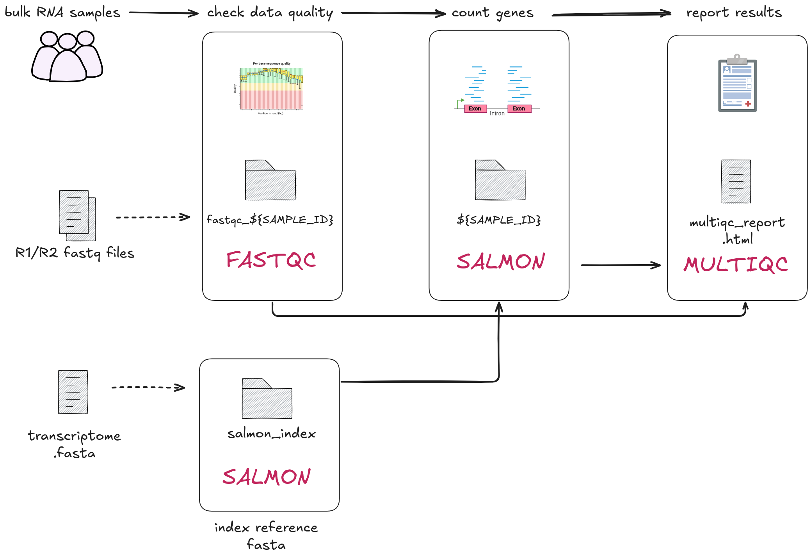
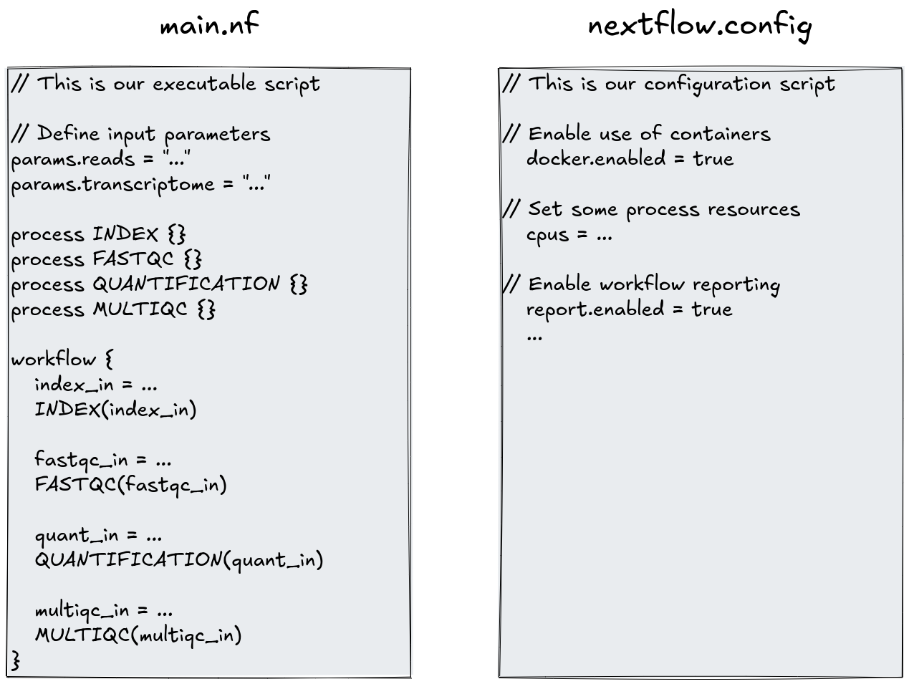

# 2.0 Introduction  

Part 2 builds on fundamental concepts learned in Part 1 and provides you with 
hands-on experience in Nextflow workflow development. Throughout the session 
we will be working with a bulk RNAseq dataset to build our workflow. 

We will construct **channels** that control how our data flows through 
**processes** that we will progressively construct to build our **workflow**. 
Each lesson in Part 2 will build on the previous lessons, so you can gain a 
deeper understanding of the techniques and the impact they have on your 
resulting workflow. 

In Part 2 of this workshop, we will explore a scenario of creating a multi-sample 
Nextflow workflow for preparing RNAseq data. We will build the workflow, 
step-by-step, by converting a series of provided bash scripts into small workflow 
components.  

Along the way, you will encounter Nextflow concepts (from Part 1, and some
new) and our best practice recommendations for developing your own pipeline.  

Part 2 is based off the 
[Simple RNA-Seq workflow](https://training.nextflow.io/basic_training/rnaseq_pipeline/)
training material developed by Seqera.  

## 2.0.1 Log back into your instance 

Re-connect to your Virtual Machine by following the 
["Connect to the VM"](../setup.md) section from the setup page.

Once connected, in your VSCode terminal, change directories into the `part2/`
directory:  

```bash
cd ~/part2/
```

All Part 2 activities will be conducted in this folder. 

## 2.0.2 Our scenario: from bash scripts to scalable workflows  

Imagine you are a bioinformatician in a busy research lab. Your team will be
receiving a large batch of samples that need to be processed through a series
of analysis steps.  

You have inherited a set of bash scripts from a former colleague, which were
used to process a handful of samples manually. These scripts are robust
and well-tested, but they were not designed with scalability in mind.  

As more samples come in, running these scripts one by one is becoming
increasingly tedious and error-prone.  

**You need a way to automate this process, ensuring consistency and efficiency
across many samples.** 

You decide to use Nextflow.  

!!! question "Exercise"

    View the bash scripts your colleague provided:

    1. Use either the VSCode File Explorer, or the integrated terminal to navgiate 
    to the `~/part2/bash_scripts/` directory.
    2. Inspect the scripts (open in a VSCode tab, or text editor in the terminal).

    Each script runs a single data processing step and are run in order of the prefixed number.

    What are some limitations of these scripts in terms of running them in a
    pipeline and monitoring it?  

    ??? note "Solution"

        * **No parallelism**: processes run iteratively, increasing overall runtime and limiting scalability. 
        * **No error handling**: if a step fails, may propagate errors or incomplete results into subsequent steps. 
        * **No caching**: if a step fails, you either need to re-run from the beginning or edit the script to exclude the files that have already run.
        * **No resource management**: inefficient resource usage, no guarantee processes are able to access the CPU, RAM, disk space they need. 
        * **No software management**: assumes same environment is available every time it is run.   

## 2.0.3 Our workflow: RNAseq data processing 

!!! danger "Don't worry if you don't have prior knowledge of RNAseq!"

    The focus of this workshop is on learning Nextflow, the RNAseq data we 
    are using in this part are just a practical example to help you understand 
    how the workflow system works. 

RNAseq is used to study gene expression and has many applications across
biomedicine, agriculture and evolutionary studies. In our scenario we are going to 
run through some basic core steps that allow us to explore different aspects of 
Nextflow. 

### Data  

The data we will use includes:

- `*.fastq`: Paired-end RNAseq reads from three different samples (gut, liver,
lung).  
- `transcriptome.fa`: A transcriptome file.  
- `samplesheet*.csv`: CSV files that help us track which files belong to which
samples.

### Tools  

We will be implementing and integrating three commonly used bioinformatics
tools:  

1. [Salmon](https://combine-lab.github.io/salmon/) is a tool for quantifying molecules known as transcripts through RNA-seq data.  
2. [FastQC](https://www.bioinformatics.babraham.ac.uk/projects/fastqc/) is a tool for quality analysis of high throughput sequence data. You can think of it as a way to assess the quality of your data.  
3. [MultiQC](https://multiqc.info/) searches a given directory for analysis logs and compiles an HTML report for easy viewing. It's a general use tool, perfect for summarising the output from numerous bioinformatics tools.  

These tools will be run using Docker containers. We will not explore how the
data and tools work further, and focus on how they should be implemented in a
Nextflow workflow.  

## 2.0.4 Pipeline structure and design 

Having reviewed the bash scripts, we've decided to keep its modular structure and will build the following four processes (discrete steps):

1. `INDEX` - Transcriptome indexing (tool: [Salmon](https://combine-lab.github.io/salmon/)): create an index of the reference transcriptome for faster and efficient data processing.
2. `FASTQC` - Raw data quality control (tool: [FastQC](https://www.bioinformatics.babraham.ac.uk/projects/fastqc/)): assess the quality of fastq files to ensure our data is usable. 
3. `QUANTIFICATION` - Gene quantification (tool: [Salmon](https://combine-lab.github.io/salmon/)): counting how many reads map to each gene in the transcriptome. 
4. `MULTIQC` - Summarise results in a report (tool: [MultiQC](https://multiqc.info/)): generate a report that summarises quality control and gene quantification results. 
  


> Update workflow with folder index output

## 2.0.5 Nextflowing the workflow

Each lesson in part 2 of our workshop focuses on implementing one process of 
the workflow at a time. We will iteratively build the workflow and processes 
in a single `main.nf` file and lightly use a `nextflow.config` file for configuration.



### `main.nf`

The `main.nf` file is the core script that defines the steps of your Nextflow
workflow. It outlines each `process` (the individual commands, or, data
processing steps) and how they are connected to each other. This `main.nf`
script focuses on _what_ the workflow does.

Most of the code you will write in this Part will go in `main.nf`. 

We will follow an ordered approach for each step of the workflow 
building off the `process` structure from [Part 1.3](../part1/03_hellonf.md).
You will be using this process template for each step of the workflow, adding 
them to the `main.nf` script: 

```groovy
process < name > {
  [ directives ]

  input:
    < process inputs >

  output:
    < process outputs >

  script:
  """
  < script to be executed >
  """
}
```

### `nextflow.config`

The `nextflow.config` file is a key part of any Nextflow workflow.
While `main.nf` outlines the steps and processes of the workflow, 
`nextflow.config` allows you to define important settings and configurations 
that control _how_ your workflow should run.

This script will be intermittently used in the following lessons to control
the use of Docker containers, how much resources (CPUs) should be used, and
reporting of the workflow after it has finished running.

