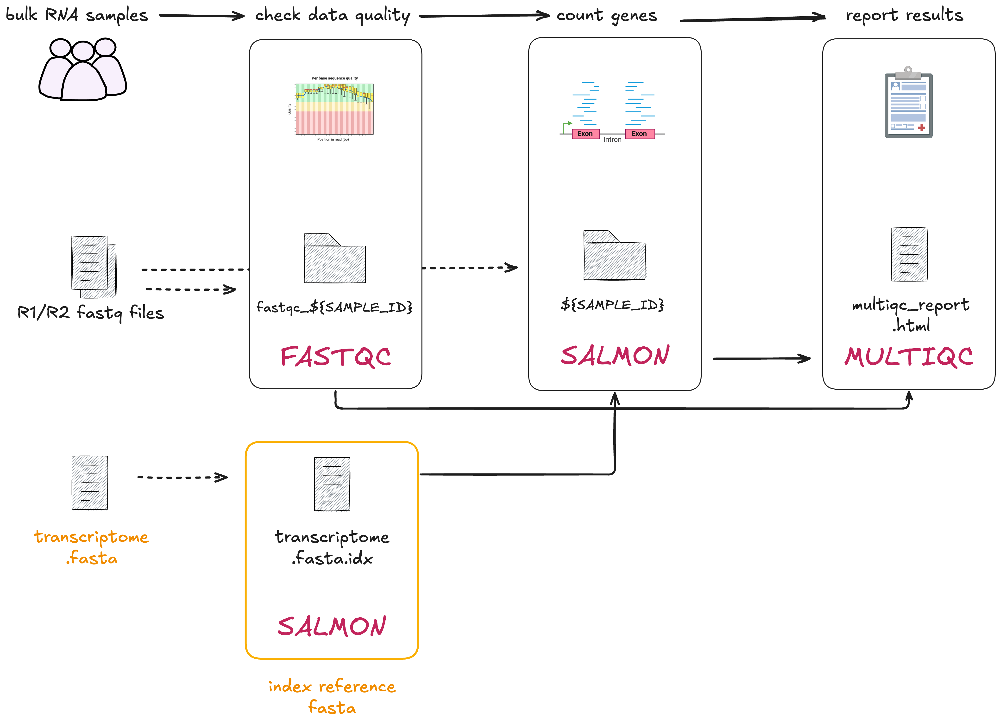

# 2.1 Implementing a simple process with a container  

!!! info "Learning objectives"

    1. Implement a Nextflow process that takes a single file as input.  
    2. Understand the importance of containers in ensuring consistent and
    reproducible execution across processes.
    3. Store output files with the `publishDir` directive.  

In this lesson we will be implement `00_index.sh` as our first Nextflow process, `INDEX`. Here, we are working with the first step of the RNA-seq data processing workflow: indexing the transcriptome for downstream processes. To do this, we will need to run [Salmon](https://salmon.readthedocs.io/en/latest/salmon.html#salmon)'s indexing mode. 
<br>
<br>
<br>

<br>
<br>
Open the bash script `00_index.sh`:  

```bash title="00_index.sh"
mkdir "results"
salmon index \
    --transcripts data/ggal/transcriptome.fa \
    --index results/salmon_index
```

- The script first creates a `results/` folder then runs the `salmon index` command.  
- The Salmon `--transcripts` flag indicates that the path to the input transcriptome
file is `data/ggal/transcriptome.fa`.  
- The Salmon `--index results/salmon_index` flag tells `salmon` to save the output index files in a directory called `salmon_index`, within the newly created `results` directory.  

!!! tip "Avoid hardcoding arguments by using parameters"

    The paths to the transcriptome file (`data/ggal/transcriptome.fa`) and the output directory (`results/salmon_index`) are hardcoded in this bash script. If you wanted to change the input transcriptome file or the output location, you must manually edit the script. This makes our scripts less flexible and easy to use. 

    Nextflow addresses the issue of hardcoded paths by allowing parameters to be passed dynamically at runtime as [parameters](https://www.nextflow.io/docs/latest/config.html#scope-params) (`params`). 

## 2.1.1 Building the process

In the empty `main.nf` script, add the following `process` scaffold with the
script definition:  

```groovy title="main.nf"
process INDEX {
  [ directives ]

  input:
    < process inputs >

  output:
    < process outputs >

  script:
  """
  salmon index --transcripts $transcriptome --index salmon_index
  """
}
```

It contains: 

* The empty `input:` block for us to define the input data for the process. 
* The empty `output:` block for us to define the output data for the process.
* The `script:` block prefilled with the command that will be executed.

!!! info 

    The process [`script`](https://www.nextflow.io/docs/latest/process.html#script)
    block is executed as a Bash script by default. In Part 2 of the workshop, we will
    only be using Nextflow variables within the `script` block.

Next, we will edit the `input` and `output` definitions to match the specific
data and results for this process. In the `00_index.sh` script, the relevant
information is:  

* The fasta (`.fa`) file defined by the variable `$transcriptome` and provided
to the `--transcripts` flag  
* The index output directory `salmon_index/` provided to the `--index` flag  

!!! info "Defining inputs and outputs"

    Remember, input and output definitions require a qualifier and name. For example:  
    ```groovy
    input:
    <input qualifier> <input name>

    output:
    <output qualifier> <output name>
    ```

    The qualifier defines the type of data, and the names are treated like variables.

```groovy title="main.nf" hl_lines="5 8"
process INDEX {
  [ directives ]

  input:
  path transcriptome

  output:
  path 'salmon_index'

  script:
  """
  salmon index --transcripts $transcriptome --index salmon_index
  """
}
```

Note that the input `path transcriptome` refers to a variable, meaning the
actual file or directory provided as input can be changed depending on the data
you provide it. The output `path 'salmon_index'` is fixed, meaning it will
always create an output folder called `salmon_index`, no matter what the input
is.  

This is how Nextflow can handle different inputs while always producing the
same output name.  

More information on using input and output blocks can be found in the process
[inputs](https://www.nextflow.io/docs/latest/process.html#inputs) and
[outputs](https://www.nextflow.io/docs/latest/process.html#outputs) Nextflow
documentation.  

## 2.1.2 Save files to an output directory with `publishDir`  

Next we will implement the Nextflow equivalent of saving the output files into a
`results/` directory.  

Replace `[ directives ]` in your `main.nf` script with the `publishDir` 
directive, specifying the directory name as `"results"` and the mode as
`'copy'`. Your `main.nf` should look like this: 

```groovy title="main.nf" hl_lines="2"
process INDEX {
  publishDir "results", mode: 'copy'

  input:
  path transcriptome

  output:
  path 'salmon_index'

  script:
  """
  salmon index --transcripts $transcriptome --index salmon_index
  """
}
```

This process is now directed to copy all output files into a `results/`
directory. This saves having to specify the output directory in the script
definition each process, or a tedious `mv salmon_index/ results/` step. 

Nextflow also handles whether the directory already exists or if it
should be created. In the `00_index.sh` script you had to manually make a 
results directory with `mkdir -p "results`.

More information and other modes can be found on
[publishDir](https://www.nextflow.io/docs/latest/process.html#publishdir).

You now have a complete process! 

## 2.1.3 Using containers  

Nextflow recommends using containers to ensure reproducibility and portability
of your workflow. Containers package all the software and dependencies needed
for each tool into a self-contained environment. This means you don’t have to
manually install anything on your system, and your workflow will work
consistently across different systems — whether you're running it on your
local machine, a cluster, or in the cloud. Containers make it easier to share
your workflow with others and ensure it runs the same way every time, no matter
where it's executed.  

Nextflow supports
[multiple container runtimes](https://www.nextflow.io/docs/latest/container.html#).
In this workshop, we'll be demonstrating the value containers can bring to your
workflow by using Docker.

??? tip "Tip: different tools for different purposes"  

    In this workshop, we're using Docker to run containers. However, for some
    systems like HPC where you won't have administrative access to your environment,
    other options like Singularity/Apptainer will be more suitable.
    
    You don't have to write your own containers to run in your workflow. There are
    many container repositories out there. We highly recommend using 
    [Biocontainers](https://biocontainers.pro/registry) wherever possible.
    Biocontainers are pre-built and tested containers specifically for
    bioinformatics tools. They have a huge library and great community support. 
    
    You can find Biocontainers at the following repositories:  
    
    * [Biocontiners registry](https://biocontainers.pro/registry)
    * [Quay.io](https://quay.io/organization/biocontainers)
    * [DockerHub](https://hub.docker.com/r/biocontainers/biocontainers)
    * [Seqera containers](https://seqera.io/containers/)

Add the following container directive to the `INDEX` process, above
`publishDir`:  

In Nextflow, we can specify that a process should be run within a specified container using the [container](https://www.nextflow.io/docs/latest/process.html#container) directive.  

Add the following container directive to the `INDEX` process, above `publishDir`:  
```groovy title="main.nf" hl_lines="2"
process INDEX {
    container "quay.io/biocontainers/salmon:1.10.1--h7e5ed60_0"
    publishDir "results" mode: 'copy'

    input:
    path transcriptome

    output:
    path 'salmon_index'

    script:
    """
    salmon index --transcripts $transcriptome --index salmon_index
    """
}
```

Usually, containers need to be downloaded using a command such as
`docker pull [image]`. All containers have been previously downloaded for the
workshop beforehand.  

??? tip "Tip: use one container per process"
    
    Using single containers for each process in your workflow is considered best practices for the following reasons:

    - **Flexibility**: different processes require different tools (or versions). By using separate containers, you can easily tailor the container to the needs of each process without conflicts.
    - **Build and run efficiency**: Smaller, process-specific containers are faster to load and run compared to one large container that has unnecessary tools or dependencies for every process.
    - **Easier Maintenance**: it’s easier to update or modify one container for a specific process than to manage a large, complex container with many tools.
    - **Reproducibility**: reduces the risk of issues caused by software conflicts.

Before we can run the workflow, we need to tell Nextflow to run containers
using Docker. Nextflow requires [Docker](https://www.nextflow.io/docs/latest/container.html#docker)
to be installed on your system in order for this to work. Docker has been 
pre-installed on your Virtual Machine.  

We can tell Nextflow configuration to run containers with Docker by using the 
`nextflow.config` file.

Create a `nextflow.config` file in the same directory as `main.nf`.  

!!! note

    You can create the file via the VSCode Explorer (left sidebar) or in the
    terminal with a text editor.

    If you are using the Explorer, right click on `part2` in the sidebar and
    select **"New file"**.

Add the following line to your config file:

```groovy linenums="1" title="nextflow.config"
docker.enabled = true
```

You have now configured Nextflow to use Docker.  

!!! tip

    Remember to save your files after editing them!

## 2.1.4 Adding `params` and the workflow scope  

Now that you have written your first Nextflow process, we need to prepare it
for execution.  

You can think of Nextflow processes as similar to a function definition in R
or Python. We have defined what the process should do, but to actually run it,
we need to call the process within the workflow and pass in the inputs.

To run the process, we need to call it inside the `workflow{}` block, where
we control how data flows through the pipeline. To provide the input data we
need to define parameters. 

In the `00_index.sh` script, the file `data/ggal/transcriptome.fa` was passed
as the input into `salmon index`.  

We will pass in this file path with the `params` scope. Add the following to 
the top of your `main.nf` script:  

```groovy title="main.nf"

// pipeline input parameters
params.transcriptome_file = "$projectDir/data/ggal/transcriptome.fa"
```

!!! info "Implicit variables in Nextflow"
    Nextflow provides a set of implicit variables that can be used in your workflows. These variables are predefined and can be used to access information about the workflow environment, configuration, and tasks. 

    We will use [`$projectDir`](https://www.nextflow.io/docs/latest/script.html#configuration-implicit-variables) to indicates the directory of the `main.nf` script. This is defined by Nextflow as the directory where the `main.nf` script is located.

!!! info "The `params` and `process` names do not need to match!"  

    In the `INDEX` process, we defined the input as a path called `transcriptome`, whereas
    the parameter is called `transcriptome_file`. These do not need to be identical names
    as they are called in different scopes (the `INDEX` process scope, and `workflow` scope,
    respectively).

Recall that [parameters](https://www.nextflow.io/docs/latest/module.html#module-parameters)
are inputs and options that can be customised when the workflow is 
executed. They allow you to control things like file paths and options for 
tools without changing the process code itself.  

We defined a default value for `params.transcriptome` in the `main.nf` script. 
If we need to run our pipeline with a different transcriptome 
file, we can overwrite this default in our execution command with 
`--transcriptome` double hyphen flag.

Next, add the workflow scope at the bottom of your `main.nf` after the process:  

```groovy title="main.nf"
// Define the workflow
workflow {

    // Run the index step with the transcriptome parameter
    INDEX(params.transcriptome_file)
}
```

This will tell Nextflow to run the `INDEX` process with
`params.transcriptome_file` as input.

!!! tip "Tip: Your own comments"

    As a developer you can to choose how and where to comment your code!
    Feel free to modify or add to the provided comments to record useful
    information about the code you are writing.

We are now ready to run our workflow!  

## 2.1.5 Running the workflow  

In the terminal, run the command:  

```bash
nextflow run main.nf
``` 

Your output should look something like:  

```console title="Output"
N E X T F L O W   ~  version 24.04.4

Launching `main.nf` [chaotic_jones] DSL2 - revision: 6597720332

executor >  local (1)
[de/fef8c4] INDEX | 1 of 1 ✔
```

Recall that the specifics of the output are randomly generated (i.e.
`[chaotic_jones]` and `[de/fef8c4]` in this example).

In this example, the output files for the `INDEX` process is output in
`work/26/c410b1...`.

You have successfully run your first workflow!  

## 2.1.6 Inspecting the outputs

To observe exactly what command is being run for a process, we can attempt 
to infer this information from the process definition in our `main.nf` 
script. Given all the different parameters that may be applied at the process 
level, it may not be very clear exactly what inputs are being fed in.

For more complex commands, it can be very hard to see what is actually 
happening in the code, given all the different variables and conditional 
arguments inside a process. 

!!! warning "Hidden files in the work directory"

    Remember that the pipeline’s results are cached in the work directory. In addition to the cached files, each task execution directories inside the work directory contains a number of hidden files:

      * `.command.sh`: The command script run for the task.
      * `.command.run`: The command wrapped used to run the task.
      * `.command.out`: The task’s standard output log.
      * `.command.err`: The task’s standard error log.
      * `.command.log`: The wrapper execution output.
      * `.command.begin`: A file created as soon as the job is launched.
      * `.exitcode`: A file containing the task exit code (0 if successful)

Instead of trying to infer how the variable is being defined and applied to 
the process, let’s use the hidden command files saved for this task in the work/ directory.

!!! question "Exercise"

    1. Navigate to the `work/` directory and open the `.command.sh` file.
    2. Compare the `.command.sh` file with `00_index.sh`.  


    !!! quote "Poll"  

        Why do we no longer see or hardcoded file paths like `results/salmon_index` and `data/ggal/transcriptome.fa` in `.command.sh`?


!!! abstract "Summary"

    In this lesson you have learned:  

    1. How to implement a simple process with one input file  
    2. How to define parameters in your workflow scripts and the command line
    3. How to use configure a process to run using a container   
    4. How to output files in a dedicated `publishDir`  
