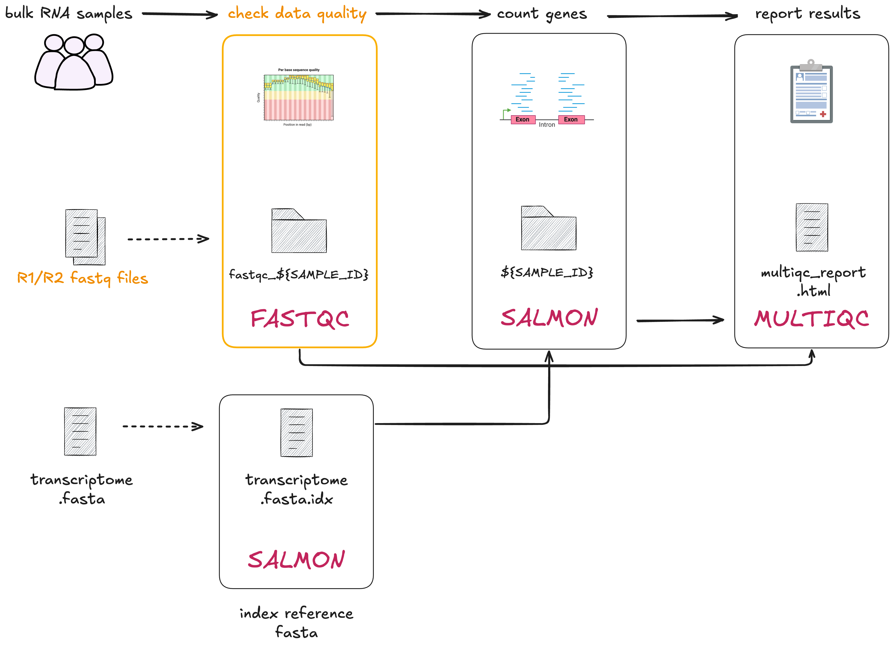
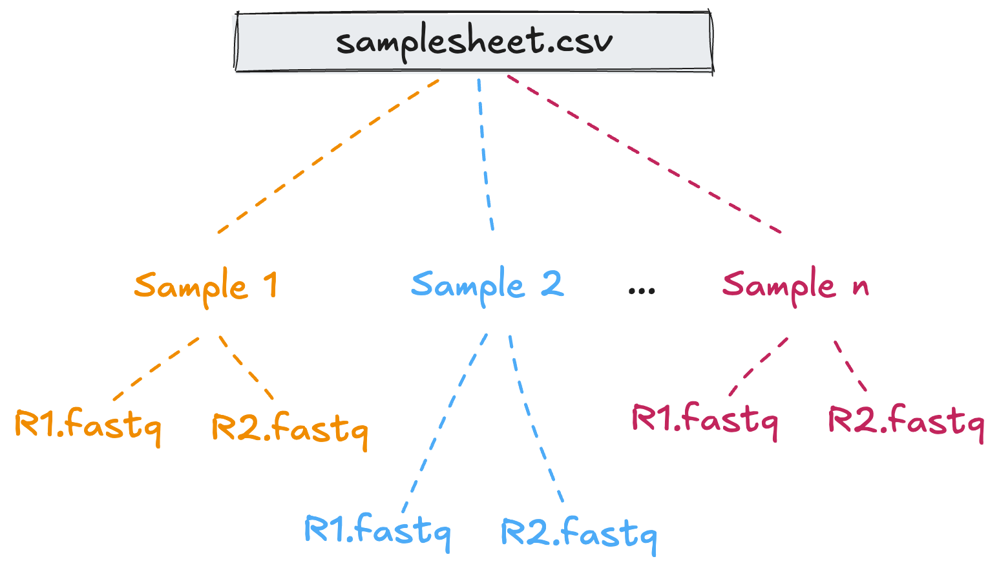

# 2.2 Samplesheets, operators, and groovy  

!!! note "Learning objectives"

    1. Implement a process with a tuple input.
    2. Understand why samplesheets should be used to read in data.
    3. Build an input channel using operators and Groovy.

In this lesson we will transform the next bash script, `01_fastqc.sh` into a process called `FASTQC`. This step focuses on the next phase of RNAseq data processing: assessing the quality of some our raw sequencing reads. 

To do this, we will need to run [FastQC](https://www.bioinformatics.babraham.ac.uk/projects/fastqc/) 
over pairs of fastq files. 



Our goal in porting these bash scripts to Nextflow is to build a workflow that can scale to run on multiple samples with minimal intervention. To do this, we will use a samplesheet, allowing us to provide multiple samples and their corresponding fastq files to our Nextflow workflow. 

Building channels in Nextflow can be tricky. Depending on what data you need 
to capture and how you want to organise it you will likely need to use 
[operators](https://www.nextflow.io/docs/latest/operator.html#operators) to
manipulate your channel. Sometimes operators alone won't be enough, and you'll
need to also use [Groovy](https://groovy-lang.org/documentation.html)
(Nextflow's underlying programming language) to capture pertinent information.  

Since this is an advanced task, we will provide you with all the code you need. Although Nextflow does not yet offer a built-in operator for reading samplesheets, their use is widespread in bioinformatics workflows. 

Open the bash script `01_fastqc.sh`:  

```bash title="01_fastqc.sh"
SAMPLE_ID=gut
READS_1="data/ggal/${SAMPLE_ID}_1.fq"
READS_2="data/ggal/${SAMPLE_ID}_2.fq"

mkdir -p "results/fastqc_${SAMPLE_ID}_logs"
fastqc \
    --outdir "results/fastqc_${SAMPLE_ID}_logs" \
    --format fastq ${READS_1} ${READS_2}
```

There's a lot going on in this script, let's break it down.

`SAMPLE_ID=gut` assigns "gut" to the bash variable`SAMPLE_ID`. This is used to:  

- Avoid hardcoding the sample name multiple times in the script  
- Ensure that file pairs of the same sample are processed together  
- Ensure that this script can be run on different sample pairs  

`READS_1` and `READS_2` specify the paths to the gut `.fq` files.  

Similar to the bash script in the previous step (`00_index.sh`), `mkdir -p`
creates an output folder so that the `fastqc` outputs can be saved here.  

In the `fastqc` command,

- `--outdir` specifies the name of the output directory
- `--format` is a required flag to indicate what format the the reads are in
- `${READS_1}` and `${READS_2}` propagate the paths of the `.fq` files  

## 2.2.1 Building the process  

### 1. Process directives

Start by adding the following `process` scaffold and script definition to your
`main.nf` under the INDEX process code but before the `workflow{}` block:  

```groovy title="main.nf"
process FASTQC {
  container "quay.io/biocontainers/fastqc:0.12.1--hdfd78af_0"
  publishDir "results", mode: 'copy'

  input:
    < process inputs >

  output:
    < process outputs >

  script:
  """
  mkdir -p "fastqc_${sample_id}_logs"
  fastqc --outdir "fastqc_${sample_id}_logs" --format fastq $reads_1 $reads_2
  """
}
```

It contains: 

* Prefilled process directives `container` and `publishDir`.
* The empty `input:` block for us to define the input data for the process. 
* The empty `output:` block for us to define the output data for the process.
* The `script:` block prefilled with the command that will be executed.

!!! info "Dynamic naming"

    Recall that curly brackets are used to pass variables as part of a file name.
    
### 2. Define the process `output`

Unlike `salmon` from the previous process, `fastqc` requires that the output
directory be created before running the command, hence the requirement to run
`mkdir -p "fastqc_${sample_id}_logs"` within the `script` block.  

Looking at the FastQC command we can see this directory will be our output.  

!!! question "Exercise"

    Replace `< process outputs >` with the appropriate output definition for
    the `FASTQC` process.  

    ??? note "Solution"

        ```groovy title="main.nf"
        output:
        path "fastqc_${sample_id}_logs"
        ```

        We've used the `path` qualifier as our output is a directory. Output 
        from the bash script is defined by the fastqc `--outdir` flag. 

### 3. Define the process `input`

Now we need to define the `input` block for this process. In this process, 
we're going to use a combination of Nextflow operators and Groovy to do this. 

There are three inputs
for this process definition that can be taken from the script definition you
just added:

1. `$sample_id`
2. `$reads_1`
3. `$reads_2`

We will use a [tuple](https://www.nextflow.io/docs/latest/process.html#input-type-tuple) as the input qualifier as it's useful to group related
inputs, or, inputs that need to be processed together such as in this case.  

We need to group these inputs together so they can be processed as a single
unit. This is a requirement when working with multiple pieces of data that are
specific to a sample.

!!! info "Importance of proper data grouping when using Nextflow"

    Nextflow uses channels to run processes in parallel and if you aren't
    careful about how handle multiple pieces of data that need to be tied
    together, you may mix datasets up.

    We can use the [input qualifier](https://www.nextflow.io/docs/latest/process.html#inputs)
    `tuple` to group multiple values into a single input definition.

Using a tuple as the input qualifier allows us to group related inputs together. 
This is useful when we need to process several pieces of data at the same time, 
like in this case where we have `$sample_id` and its two read files `$reads_1` 
and `$reads_2`. 



The tuple ensures that these inputs stay linked and are processed together, preventing sample-specific data and files from getting mixed up between samples.

In the `FASTQC` process, replace `< process inputs >` with the input definition:  

```
tuple val(sample_id), path(reads_1), path(reads_2)
```

* `val(sample_id)` represents the **value** that refers to the sample name.
* `path(reads_1)` represents the **path** to the first read file of paired-end sequencing data.
* `path(reads_2)` represent the **path** to the second read file of paired-end sequencing data.

```groovy title="main.nf" hl_lines="6"
process FASTQC {
  container "quay.io/biocontainers/fastqc:0.12.1--hdfd78af_0"
  publishDir "results", mode: 'copy'

  input:
  tuple val(sample_id), path(reads_1), path(reads_2)

  output:
  path "fastqc_${sample_id}_logs"

  script:
  """
  fastqc --outdir "fastqc_${sample_id}_logs" --format fastq $reads_1 $reads_2
  """
}
```

## 2.2.2 Reading files with a samplesheet  

A samplesheet is a delimited text file where each row contains information
or metadata that needs to be processed together. 

??? Tip "Tip: using samplesheets in scalable bioinformatics workflows"
      
      Working with samplesheets is particularly useful when you have a combination of files and metadata that need to be assigned to a sample in a flexible manner. Typically, samplesheets are written in comma-separated (`.csv`) or tab-separated (`.tsv`) formats. 
      
      We recommend using comma-separated files as they are less error prone and easier to read and write.

Let's inspect `data/samplesheet.csv` with VSCode.

```console title="Output"
sample,fastq_1,fastq_2
gut,data/ggal/gut_1.fq,data/ggal/gut_2.fq
```

At this stage, we are developing and testing the pipeline. As such, we're only working with one sample. The samplesheet has three columns:  

- `sample`: indicates the sample name/prefix
- `fastq_1`, `fastq_2`: contains the relative paths to the reads  

The goal in this step is to read the contents of the samplesheet, and transform
it so it fits the input definition of `FASTQC` we just defined:

```bash
tuple val(sample_id), path(reads_1), path(reads_2)
```

Before that, we need to add an input parameter that points to the samplesheet, called `input`.  

!!! question "Exercise"

    In your `main.nf` add an input parameter called `reads` and assign the path
    to the samplesheet using `$projectDir`.

    ??? note "Solution"

        ```groovy title="main.nf"
        // pipeline input parameters
        params.transcriptome_file = "$projectDir/data/ggal/transcriptome.fa"
        params.reads = "$projectDir/data/samplesheet.csv"
        ```

In the next few steps, we will add a mix of Nextflow operators and Groovy
syntax to read in and parse the samplesheet so it is in the correct format
for the process we just added.  

!!! info "Using samplesheets with Nextflow can be tricky business"
    There are currently no Nextflow operators specifically designed to handle samplesheets. As such, we Nextflow workflow developers have to write custom parsing logic to read and split the data. This adds complexity to our workflow development, especially when trying to handle tasks like parallel processing of samples or filtering data by sample type.

Add the following to your workflow scope below where `INDEX` is called:

```groovy title="main.nf" hl_lines="7-12"
// Define the workflow  
workflow {

    // Run the index step with the transcriptome parameter
    INDEX(params.transcriptome_file)

    // Define the fastqc input channel
    Channel.fromPath(params.reads)
        .splitCsv(header: true)
        .map { row -> [row.sample, file(row.fastq_1), file(row.fastq_2)] }
        .view()

}
```

We won't explore the logic of constructing our samplesheet input channel in depth in this lesson. The key takeaway here is to understand that using samplesheets is best practice for reading grouped files and metadata into Nextflow, and that operators and groovy needs to be chained together to get these in the correct format. The best way to do this is using a combination of Groovy and Nextflow operators.

Our samplesheet input channel has used common [Nextflow operators](https://www.nextflow.io/docs/latest/operator.html):

* `.fromPath` creates a channel from one or more files matching a given path or pattern (to our `.csv` file, provided with the `--reads` parameter).
* `splitCsv` splits the input file into rows, treating it as a CSV (Comma-Separated Values) file. The `header: true` option means that the first row of the CSV contains column headers, which will be used to access the values by name.
* `map { row -> [row.sample, file(row.fastq_1), file(row.fastq_2)] }` uses some Groovy syntax to transform each row of the CSV file into a list, extracting the sample value, `fastq_1` and `fastq_2` file paths from the row.
* `.view()` is a debugging step that outputs the transformed data to the console so we can see how the channel is structured. Its a great tool to use when building your channels.

??? Tip "Tip: using the `view()` operator for testing"
      
      The [`view()`](https://www.nextflow.io/docs/latest/operator.html#view) operator is a useful tool for debugging Nextflow workflows. It allows you to inspect the data structure of a channel at any point in the workflow, helping you to understand how the data is being processed and transformed.

Run the workflow with the `-resume` flag:

```bash
nextflow run main.nf -resume
```

Your output should look something like:  

```console title="Output"
Launching `main.nf` [crazy_einstein] DSL2 - revision: 0ae3776a5e

[de/fef8c4] INDEX [100%] 1 of 1, cached: 1 ✔
[gut, /home/setup2/hello-nextflow/part2/data/ggal/gut_1.fq, /home/setup2/hello-nextflow/part2/data/ggal/gut_2.fq]

```

??? Tip "Tip: using the `-resume` flag"
      
      The `-resume` flag is used to resume a Nextflow workflow from where it left off. If a workflow fails or is interrupted, this flag allows you to skip tasks that were successfully completed, saving time and computational resources. It is also useful when you are developing a workflow and want to test changes without running the entire workflow from the start. 

The chain of commands produces a tuple with three elements that correspond to
the row in the samplesheet. It now fits the requirements of the input
definition of `tuple val(sample_id), path(reads_1), path(reads_2)`: 

```bash
[gut, /home/setup2/hello-nextflow/part2/data/ggal/gut_1.fq, /home/setup2/hello-nextflow/part2/data/ggal/gut_2.fq]
```

!!! quote "Checkpoint"  

    Zoom react Y/N

Next, we need to assign the channel we create to a variable so it can be passed to the `FASTQC`
process. Assign to a variable called `reads_in`, and remove the `.view()`
operator as we now know what the output looks like.

```groovy title="main.nf" hl_lines="8-11"
// Define the workflow  
workflow {

    // Run the index step with the transcriptome parameter
    INDEX(params.transcriptome_file)

    // Define the fastqc input channel
    reads_in = Channel.fromPath(params.reads)
        .splitCsv(header: true)
        .map { row -> [row.sample, file(row.fastq_1), file(row.fastq_2)] }

}
```

Now that we have an input channel with that provides the correct format ready,
we will now call the `FASTQC` process.  

!!! question "Exercise"

    In the `workflow` scope after where `reads_in` was defined, call the
    `FASTQC` process with `reads_in` as the input.

    ??? note "Solution"
    
        ```groovy title="main.nf" hl_lines="12-14"
        // Define the workflow  
        workflow {
        
            // Run the index step with the transcriptome parameter
            INDEX(params.transcriptome_file)
        
            // Define the fastqc input channel
            reads_in = Channel.fromPath(params.reads)
                .splitCsv(header: true)
                .map { row -> [row.sample, file(row.fastq_1), file(row.fastq_2)] }

            // Run the fastqc step with the reads_in channel
            FASTQC(reads_in) 
            
        }
        ```

Run the workflow:  

```bash
nextflow run main.nf -resume
```

Your output should look something like:  

```
Launching `main.nf` [tiny_aryabhata] DSL2 - revision: 9a45f4957b

executor >  local (1)
[de/fef8c4] INDEX      [100%] 1 of 1, cached: 1 ✔
[bb/32a3aa] FASTQC (1) [100%] 1 of 1 ✔
```

If you inspect `results/fastqc_gut_logs` there is an `.html` and `.zip` file
for each of the `.fastq` files.  

> Need to revisit the Advanced exercise  

??? example "Advanced exercise"  

    Inspect what the `.fromPath()` and `.splitCsv()` commands do by using `.view()`

    ```groovy title="main.nf"
    workflow {
        Channel
            .fromPath(params.reads)
            .view()
    
        index_ch = INDEX(params.transcriptome_file)
    ```
    
    ```console title="Output"
    Launching `main.nf` [hungry_lalande] DSL2 - revision: 587b5b70d1
    
    [de/fef8c4] INDEX [100%] 1 of 1, cached: 1 ✔
    /home/setup2/hello-nextflow/part2/data/samplesheet.csv
    
    ```
    
    ```groovy title="main.nf"
    workflow {
        Channel
            .fromPath(params.reads)
            .splitCsv(header: true)
            .view()
    
        index_ch = INDEX(params.transcriptome_file)
    ```
    
    ```console title="Output"
    Launching `main.nf` [tiny_yonath] DSL2 - revision: 22c2c9d28f
    [de/fef8c4] INDEX | 1 of 1, cached: 1 ✔
    [sample:gut, fastq_1:data/ggal/gut_1.fq, fastq_2:data/ggal/gut_2.fq]
    
    ```

!!! abstract "Summary"

    In this step you have learned:

    1. How to implement a process with a tuple input
    2. How to construct an input channel using operators and Groovy
    3. How to use the `.view()` operator to inspect the structure of a channel
    3. How to use the `-resume` flag to skip sucessful tasks
    4. How to use a samplesheet to read in grouped samples and metada
