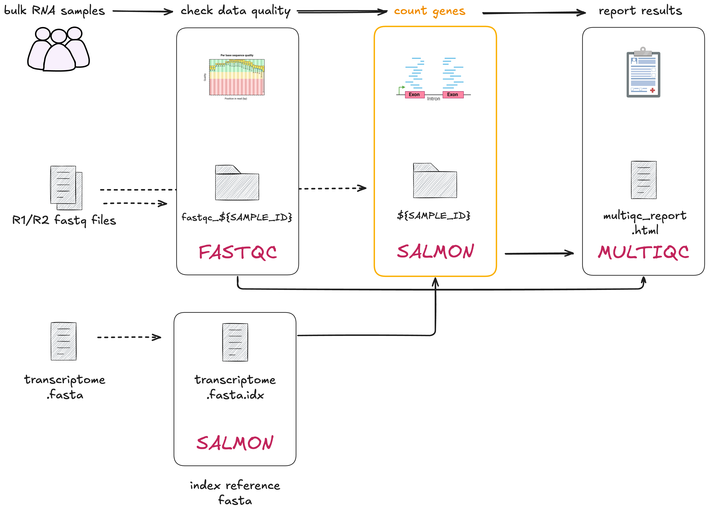

# 2.3 Multiple inputs into a single process

!!! note "Learning objectives"

    1. Implement a process with multiple input channels. 
    2. Understand the importance of creating channels from process outputs.
    3. Implement chained Nextflow processes with channels.  

In this lesson we will transform the bash script `02_quant.sh` into a process called `QUANTIFICATION`. This step focuses on the next phase of RNAseq data processing: quantifying the expression of transcripts relative to the reference transcriptome. 

To do this, we will need to run [Salmon's](https://salmon.readthedocs.io/en/latest/salmon.html) quant mode over the paired-end reads and the transcriptome index.
<br>
<br>
<br>

<br>
<br>

Open the bash script `02_quant.sh`.  

```bash title="02_quant.sh"
SAMPLE_ID=gut
READS_1="data/ggal/${SAMPLE_ID}_1.fq"
READS_2="data/ggal/${SAMPLE_ID}_2.fq"

salmon quant \
    --libType=U \
    -i results/salmon_index \
    -1 ${READS_1} \
    -2 ${READS_2} \
    -o results/${SAMPLE_ID}
```

Same as the previous lesson, this script contains the `${SAMPLE_ID}` variable defintions which is used to connect sample names to fastq file paths. Within the `salmon quant` execution command: 
 
- `--libType=U` is a required argument for Salmon. 
- `-i results/salmon_index` is the directory output by the `INDEX` process. 
- `-1` and `-2` are flags for the respective paired reads (`.fq`). 
- `-o` outputs files into a directory called `results/gut`

## 2.3.1 Building the process  

### 1. Process directives  

Here is the empty `process` template with the `container` and `publishDir`
directives we'll be using to get you started. Add this to your `main.nf` after where you defined the `FASTQC` process.  

```groovy title="main.nf"
process QUANTIFICATION {
  container "quay.io/biocontainers/salmon:1.10.1--h7e5ed60_0"
  publishDir "results", mode: 'copy'

  input:
    < process inputs >

  output:
    < process outputs >

  script:
  """
    < script to be executed >
  """
}

```

It contains: 

* Prefilled process directives `container` and `publishDir`.
* The empty `input:` block for us to define the input data for the process. 
* The empty `output:` block for us to define the output data for the process.
* The empty `script:` block for us to define the script for the process.


### 2. Define the process `script`  

Update the `script` definition with the Salmon command from the bash script:

```groovy title="main.nf" hl_lines="13"
process QUANTIFICATION {
  container "quay.io/biocontainers/salmon:1.10.1--h7e5ed60_0"
  publishDir "results", mode: 'copy'

  input:
    < process inputs >

  output:
    < process outputs >

  script:
  """
  salmon quant --libType=U -i $salmon_index -1 $reads_1 -2 $reads_2 -o $sample_id
  """
}
```

The `--libType=U` is a required argument and can be left as is for the script definition. It can stay the same as in the bash script. The following need to be adjusted for the `QUANT` process: 

- `-i results/salmon_index` is the directory output by the `INDEX` process. 
- `-1 $reads_1` and `-2 $reads_2` are fastq files from the previously defined `reads_ch` channel. 
- `-o` outputs files into a directory named after the `$sample_id`.

### 3. Define the process `output`

The `output` is a directory of `$sample_id`. In this case, it will be a
directory called `gut/`. Replace `< process outputs >` with the following:  

```groovy title="main.nf" hl_lines="9"
process QUANTIFICATION {
  container "quay.io/biocontainers/salmon:1.10.1--h7e5ed60_0"
  publishDir "results", mode: 'copy'

  input:
    < process inputs >

  output:
  path "$sample_id"

  script:
  """
  salmon quant --libType=U -i $salmon_index -1 $reads_1 -2 $reads_2 -o $sample_id
  """
}
```

### 4. Define the process `input`  

In this step we will define the process inputs. Based on the bash script, we
have four inputs:  

- `$salmon_index`
- `$sample_id`
- `$reads_1`
- `$reads_2`

These should look familiar! 

The `$salmon_index` was output by the `INDEX` process, and `$sample_id`,
`$reads_1`, `$reads_2` are output by our `reads_in`. We will see how to
chain these when we work on the `workflow` scope below.

First, add the input definition for `$salmon_index`. Recall that we use the
`path` qualifier as it is a directory:  

```groovy title="main.nf" hl_lines="6"  
process QUANTIFICATION {
  container "quay.io/biocontainers/salmon:1.10.1--h7e5ed60_0"
  publishDir "results", mode: 'copy'

  input:
  path salmon_index

  output:
  path "$sample_id"

  script:
  """
  salmon quant --libType=U -i $salmon_index -1 $reads_1 -2 $reads_2 -o $sample_id
  """
}
```

Secondly, add the tuple input:  

```groovy title="main.nf" hl_lines="7"
process QUANTIFICATION {
  container "quay.io/biocontainers/salmon:1.10.1--h7e5ed60_0"
  publishDir "results", mode: 'copy'

  input:
  path salmon_index
  tuple val(sample_id), path(reads_1), path(reads_2)

  output:
  path "$sample_id"

  script:
  """
  salmon quant --libType=U -i $salmon_index -1 $reads_1 -2 $reads_2 -o $sample_id
  """
}
```

!!! info "Matching process inputs"

    Recall that the number of inputs in the process input block and the workflow must match!

    If you have multiple inputs they need to be listed across multiple lines in the input block and listed inside the brackets in the workflow block.

You have just defined a process with multiple inputs!  

### 5. Call the process in the `workflow` scope  

Recall that the inputs for the `QUANTIFICATION` process are emitted by the
`reads_in` channel and the output of the `INDEX` process. The `reads_in` channel 
is ready to be called by the `QUANTIFICATION` process. Similarly, we need to
prepare a channel for the index files output by the `INDEX` process.

Add the following channel to your `main.nf` file, after the `FASTQC` process:

```groovy title="main.nf" hl_lines="15-16"
// Define the workflow
workflow {

    // Run the index step with the transcriptome parameter
    INDEX(params.transcriptome_file)

    // Define the fastqc input channel
    reads_in = Channel.fromPath(params.reads)
        .splitCsv(header: true)
        .map { row -> [row.sample, file(row.fastq_1), file(row.fastq_2)] }

    // Run the fastqc step with the reads_in channel
    FASTQC(reads_in)

    // Define the quantification channel for the index files
    transcriptome_index_in = INDEX.out[0]

}
```

!!! info "Accessing process outputs"
    
    Nextflow allows us to explicitly define the output of a channel using the `.out` attribute. If a process has 2 or more output channels, you can access them by indexing the `.out` attribute. For example: `.out[0]` for the first output, `.out[1]` for the second output.

    Alternatively, the process output definition allows the use of the [`emit`](https://www.nextflow.io/docs/latest/workflow.html#workflow-outputs-emit) statement to define a named identifier that can be used to reference the channel in the external scope.

Call the `QUANTIFICATION` process in the workflow scope and add the inputs by adding the following line to your `main.nf` file after your `transcriptome_index_in` channel definition:  

```groovy title="main.nf" hl_lines="18-19"
// Define the workflow
workflow {

    // Run the index step with the transcriptome parameter
    INDEX(params.transcriptome_file)

    // Define the fastqc input channel
    reads_in = Channel.fromPath(params.reads)
        .splitCsv(header: true)
        .map { row -> [row.sample, file(row.fastq_1), file(row.fastq_2)] }

    // Run the fastqc step with the reads_in channel
    FASTQC(reads_in)

    // Define the quantification channel for the index files
    transcriptome_index_in = INDEX.out[0]

    // Run the quantification step with the index and reads_in channels
    QUANTIFICATION(transcriptome_index_in, reads_in)

}
```

By doing this, we have passed two arguments to the `QUANTIFICATION` process as there are two inputs in the `process` definition. 

Run the workflow:  

```bash
nextflow run main.nf -resume
```

Your output should look like:  

```console title="Output"
Launching `main.nf` [shrivelled_cuvier] DSL2 - revision: 4781bf6c41

executor >  local (1)
[de/fef8c4] INDEX              | 1 of 1, cached: 1 ✔
[bb/32a3aa] FASTQC (1)         | 1 of 1, cached: 1 ✔
[a9/000f36] QUANTIFICATION (1) | 1 of 1 ✔

```

A new `QUANTIFICATION` task has been successfully run and have a `results/gut`
folder, with an assortment of files and directories. 

!!! abstract "Summary"

    In this lesson you have learned:  

    1. How to define a process with multiple input channels
    2. How to access a process output with `.out`
    3. How to create a channel from a process output
    4. How to chain Nextflow processes with channels  


