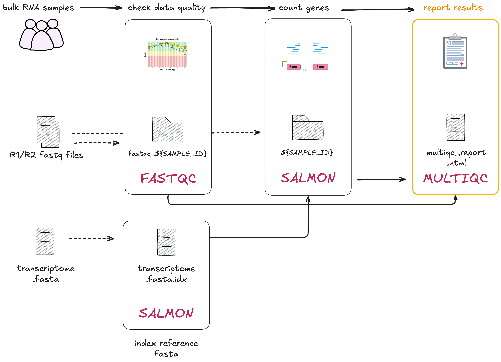

# 2.4 Combining channels and multiple process outputs  

!!! note "Learning objectives"  

    1. Implement a channel that combines the contents of two channels.  
    2. Implement a process with multiple output files.  

In this step we will transform the `03_multiqc.sh` into a process called `MULTIQC`. 
This step focuses on the final step of our RNAseq data processing workflow: generating
a report that summarises the quality control and quantification steps. 

To do this, we will run [MultiQC](https://multiqc.info/), which is a popular tool 
for summarising the outputs of many different bioinformatics tools. It aggregates results from all our analyses and renders it into a nice report. 

!!! info "From the MultiQC [docs](https://multiqc.info/docs/)"
    
    MultiQC doesn’t do any analysis for you - it just finds results from
    other tools that you have already run and generates nice reports. See [here](https://multiqc.info/modules/) for a list of supported tools. You 
    can also see an example report [here](https://multiqc.info/examples/rna-seq/multiqc_report).
<br>
<br>

<br>
<br>

Open the bash script `03_multiqc.sh`.  

```bash title="03_multiqc.sh"
multiqc --outdir results/ results/
```

This script is a lot simpler than previous scripts we've worked with. It searches searches for the output files generated by the `FASTQC` and `QUANTIFICATION` processes saved to the `results/` directory. As specified by `--outdir results/`, it will output two MultiQC files:  

1. A directory called `multiqc_data/` 
2. A report file called `multiqc_report.html` 

## 2.4.1 Building the process 

### 1. Process directives, `script`, and `input`

Here is the `process` template with the `container` and `publishDir`
directives provided. Add this to your `main.nf` after the `QUANTIFICATION` process:  

```groovy title="main.nf"
process MULTIQC {
  container "quay.io/biocontainers/multiqc:1.19--pyhdfd78af_0"
  publishDir "results", mode: 'copy'

  input:
  path "*"

  output:
    < process outputs >

  script:
  """
  multiqc .
  """
}
```

The `script` and `input` follow the MultiQC Nextflow
[integration recommendations](https://multiqc.info/docs/usage/pipelines/#nextflow). 
The key thing to note here is that MultiQC needs to be run once for all
upstream outputs. 

From the information above we know that the input for `multiqc` is the 
`results/` directory, specifically, the files and directories within
`results/`. We will need to bring the outputs of the `FASTQC`
(`fastqc_gut_logs/`) and `QUANTIFICATION` (`gut/`) processes into a single
channel as input to `MULTIQC`.  

!!! warning "Why you should NOT use the `publishDir` folder as a process input"

    It might make sense to have the `results/` folder (set by `publishDir`) as
    the input to the process here, but it may not exist until the workflow
    finishes. 

    Using the `publishDir` as a process input can cause downstream processes 
    prematurely, even if the directory is empty or incomplete. In this case, 
    MultiQC might miss some inputs.

    Use **channels** to pass data between processes. Channels enable Nextflow
    to track outputs and ensure that downstream processes only run when all
    required data is ready, maintaining proper worfklow control.

More on this in the next section.  

### 2. Define the process `output`

The MultiQC output consists of the following:

* An HTML report file called `multiqc_report.html`
* A directory called `multiqc_data/` containing the data used to generate the report.

Add the following `output` definition to the `MULTIQC` process:  

```groovy title="main.nf" hl_lines="10-11"
process MULTIQC {

  container "quay.io/biocontainers/multiqc:1.19--pyhdfd78af_0"
  publishDir params.outdir, mode: 'copy'

  input:
  path "*"  

  output:
  path "multiqc_report.html"
  path "multiqc_data"

  script:
  """
  multiqc .
  """
}
```

## 2.4.2 Combining channels with operators  

!!! tip

    When running MultiQC, it needs to be run once on all the upstream input files.
    This is so a single report is generated with all the results.

In this case, the input files for the `MULTIQC` process are outputs from
`FASTQC` and `QUANTIFICATION` processes. Both FastQC and Salmon are supported
by MultiQC and the required files are detected automatically by the program
(when using it a Nextflow pipeline, there is some pre-processing that needs to
be done).

The goal of this step is to bring the outputs from `MULTIQC` and
`QUANTIFICATION` processes into a single input channel for the `MULTIQC`
process. This ensures that MultiQC is run once.  

The next few additions will involve chaining together Nextflow operators to
correctly format inputs for the `MULTIQC` process.  

!!! quote "Poll"

    What Nextflow input type (qualifier) ensures that inputs are grouped and
    processed together?

Add the following to the workflow block in your `main.nf` file, under the
`QUANTIFICATION` process.  

```groovy title="main.nf" hl_lines="21-24"
// Define the workflow
workflow {

    // Run the index step with the transcriptome parameter
    INDEX(params.transcriptome_file)

    // Define the fastqc input channel
    reads_in = Channel.fromPath(params.reads)
        .splitCsv(header: true)
        .map { row -> [row.sample, file(row.fastq_1), file(row.fastq_2)] }

    // Run the fastqc step with the reads_in channel
    FASTQC(reads_in)

    // Define the quantification channel for the index files
    transcriptome_index_in = INDEX.out[0]

    // Run the quantification step with the index and reads_in channels
    QUANTIFICATION(transcriptome_index_in, reads_in)

    // Define the multiqc input channel
    FASTQC.out[0]
        .mix(QUANTIFICATION.out[0])
        .view()

}
```

This channel creates a tuple with the two inputs as elements:

- Takes the output of `FASTQC`, using element `[0]` to refer to the first element of the output. 
- Uses `mix(QUANTIFICATION.out[0])` to combine `FASTQC.out[0]` output with the first element of the `QUANTIFICATION` output.
- Uses `view()` allows us to see the values emitted into the channel.

For more information, see the documentation on
[`mix`](https://www.nextflow.io/docs/latest/operator.html#mix).

Run the workflow to see what it produces:  

```bash
nextflow run main.nf -resume  
```

The output should look something like:  

```console title="Output"
Launching `main.nf` [stupefied_minsky] DSL2 - revision: 82245ce02b

[de/fef8c4] INDEX              | 1 of 1, cached: 1 ✔
[bb/32a3aa] FASTQC (1)         | 1 of 1, cached: 1 ✔
[a9/000f36] QUANTIFICATION (1) | 1 of 1, cached: 1 ✔
/home/user1/part2/work/bb/32a3aaa5e5fd68265f0f34df1c87a5/fastqc_gut_logs
/home/user1/part2/work/a9/000f3673536d98c8227b393a641871/gut
```  

The outputs have been emitted one after the other, meaning that it will be
processed separately. We need them to be processed together (generated in the
same MultiQC report), so we need to add one more step.  

!!! note

    Note that the outputs point to the files in the work directories, rather than
    the `publishDir`. This is one of the ways that Nextflow ensures all input files
    are ready and ensures proper workflow control.


Add the [`collect`](https://www.nextflow.io/docs/latest/operator.html#collect)
operator to ensure all samples are processed together in the same
process and view the output:  

```groovy title="main.nf" hl_lines="24"
// Define the workflow
workflow {

    // Run the index step with the transcriptome parameter
    INDEX(params.transcriptome_file)

    // Define the fastqc input channel
    reads_in = Channel.fromPath(params.reads)
        .splitCsv(header: true)
        .map { row -> [row.sample, file(row.fastq_1), file(row.fastq_2)] }

    // Run the fastqc step with the reads_in channel
    FASTQC(reads_in)

    // Define the quantification channel for the index files
    transcriptome_index_in = INDEX.out[0]

    // Run the quantification step with the index and reads_in channels
    QUANTIFICATION(transcriptome_index_in, reads_in)

    // Define the multiqc input channel
    FASTQC.out[0]
        .mix(QUANTIFICATION[0])
        .collect()
        .view()

}
```

Run the workflow:  

```bash
nextflow run main.nf -resume  
```

The channel now outputs a single tuple with the two directories:  

```console title="Output"
Launching `main.nf` [small_austin] DSL2 - revision: 6ab927f137

[de/fef8c4] INDEX              | 1 of 1, cached: 1 ✔
[bb/32a3aa] FASTQC (1)         | 1 of 1, cached: 1 ✔
[a9/000f36] QUANTIFICATION (1) | 1 of 1, cached: 1 ✔
[/home/user1/part2/work/bb/32a3aaa5e5fd68265f0f34df1c87a5/fastqc_gut_logs, /home/user1/part2/work/a9/000f3673536d98c8227b393a641871/gut]

```

Now that we have a channel that emits the correct data, add the finishing
touches to the workflow scope.

!!! question "Exercise: Assign the input channel"

    1. Assign the chain of operations to a channel called `multiqc_in`
    2. Remove the `.view()` operator  

    ??? note "Solution"
        
        ```groovy title="main.nf" hl_lines="8 11"
            // Define the quantification channel for the index files
            transcriptome_index_in = INDEX.out[0]
        
            // Run the quantification step with the index and reads_in channels
            QUANTIFICATION(transcriptome_index_in, reads_in)
       
            // Define the multiqc input channel
            multiqc_in = FASTQC.out[0]
                .mix(QUANTIFICATION[0])
                .collect()

        }
        ```

!!! question "Exercise: call the `MULTIQC` process"

    1. Add the `MULTIQC` process in the workflow scope
    2. Pass the `multiqc_in` channel as input.

    ??? note "Solution"

        ```groovy title="main.nf" hl_lines="12-17"
            // Define the quantification channel for the index files
            transcriptome_index_in = INDEX.out[0]
        
            // Run the quantification step with the index and reads_in channels
            QUANTIFICATION(transcriptome_index_in, reads_in)
       
            // Define the multiqc input channel
            multiqc_in = FASTQC.out[0]
                .mix(QUANTIFICATION[0])
                .collect()

            // Run the multiqc step with the multiqc_in channel
             MULTIQC(multiqc_in)
       
        }
        ```

Run the workflow:  

```bash
nextflow run main.nf -resume  
```

Your output should look something like:  

```console title="Output"
Launching `main.nf` [hopeful_swanson] DSL2 - revision: a4304bbe73

[aa/3b8821] INDEX          [100%] 1 of 1, cached: 1 ✔
[c2/baa069] QUANTIFICATION [100%] 1 of 1, cached: 1 ✔
[ad/e49b20] FASTQC         [100%] 1 of 1, cached: 1 ✔
[a3/1f885c] MULTIQC        [100%] 1 of 1 ✔

```

## 2.4.3 Inspecting the MultiQC report  

Let's inspect the generated MultiQC report. You will need to download the file
to your local machine and open it in a web browser.  

!!! question "Exercise"  

    1. In the VSCode Explorer sidebar, locate the report `results/multiqc_report.html`  
    2. Right click on the file, and select **"Download"**
    3. Open the file in a web browser

    !!! quote "Poll"  

        Under the **"General Statistics"** section, how many samples (i.e. rows) have been
        included in the table?

!!! tip

    If you have to view many (i.e. `.html`) files on a remote server, we recommend using the 
    [Live Server](https://marketplace.visualstudio.com/items?itemName=ritwickdey.LiveServer)
    VSCode extension. 

    The extension allows you to view `.html` files within a VSCode tab instead
    of manually downloading files locally.

You have a working pipeline for a single paired-end sample!

    
!!! abstract "Summary"

    In this lesson you have learned:

    1. How to implement a process following integration recommendations
    2. How to define an output with multiple outputs
    3. How to use the `mix` and `collect` operators to combine outputs into a single tuple
    4. How to access and view `.html` files from a remote server
