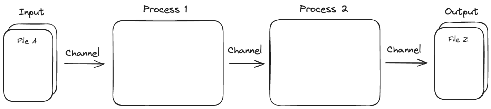

# Our first pipeline

Nextflow is a workflow orchestration engine and domain-specific language (DSL) that makes it easy to write data-intensive computational workflows.

Here, we're going learn more about the Nextflow language and take our first steps making a **our first pipeline** with Nextflow. 

## Processes and channels

A Nextflow workflow is made by joining together **processes**. Each process can be written in any scripting language that can be executed by the Linux platform.

Processes are executed independently and are isolated from each other, i.e., they do not share a common (writable) state. The only way they can communicate is via asynchronous first-in, first-out (FIFO) queues, called **channels**. In other words, every input and output of a process is represented as a channel. The interaction between these processes, and ultimately the workflow execution flow itself, is implicitly defined by these input and output declarations.



## `hello-world.nf`

Nextflow pipelines need to be saved as `.nf` files.

The process definition starts with the keyword `process`, followed by process name, and finally the process body delimited by curly braces. The process body must contain a `script` block which represents the command or, more generally, a script that is executed by it.

A process may contain any of the following definition blocks: `directives`, `inputs`, `outputs`, `when` clauses, and of course, `script`.

```groovy
process < name > {
  [ directives ]

  input:
    < process inputs >

  output:
    < process outputs >

  when:
    < condition >

  script:
  """
  < script to be executed >
  """
}
```

A workflow is a composition of processes and dataflow logic.

The workflow definition starts with the keyword `workflow`, followed by an optional name, and finally the workflow body delimited by curly braces.

Let's review the structure of  `hello-world.nf`, a toy example we will be executing and developing:

```groovy title="hello-world.nf" linenums="1"
process SAYHELLO {
    debug true

    output: 
    stdout
    
    script:
    """
    echo 'Hello World!'
    """
}

workflow {
    SAYHELLO()
}
```

The first piece of code (lines 1-11) describes a **process** called `SAYHELLO` with three definition blocks:

- **debug**: a [directive](https://www.nextflow.io/docs/latest/process.html#directives) that, when set to true, will print the output to the console
- **output**: directing outputs to be printed to `stdout` (standard output)
- **script**: the `echo 'Hello World!'` command

The second block of code (13-15) lines describes the **workflow** itself, which consists of one call to the `SAYHELLO` process.

!!!note

    Using `debug true` and `stdout` in combination will cause 'Hello World!' to be printed to the terminal.

## Commenting our code

It is worthwhile to **comment** our code so we, and others, can easily understand what the code is doing (we will thank ourselves later).

In Nextflow, a single line comment can be added by prepending it with two forward slash (`//`):

```groovy
// This is my comment 
```

Similarly, multi-line comments can be added using the following format:

```groovy
/*
 * Use echo to print 'Hello World!' to standard out
 */
```

As a developer we can to choose how and where to comment our code.

!!!question "Exercise"

    Add a comment to the pipeline to describe what the **process** block is doing

    ??? "Solution"

        The solution may look something like this:

        ```groovy title="hello-world.nf"
        /*
         * Use echo to print 'Hello World!' to standard out
         */
        process SAYHELLO {
        <truncated>
        ```

        Or this:

        ```groovy title="hello-world.nf"
        // Use echo to print 'Hello World!' to standard out
        process SAYHELLO {
        <truncated>
        ```

        As a developer, you get to choose!

---

## Executing `hello-world.nf`

The **`nextflow run`** command is used to execute Nextflow pipelines:

```bash
nextflow run <pipeline.nf>
```

When a pipeline is stored locally we need to supply the full path to the script. However, if the pipeline has been submitted to GitHub (and we have an internet connection) we can execute it without a local copy. For example, the **hello** repository hosted on the **nextflow-io** GitHub account can be executed using:

```bash
nextflow run nextflow-io/hello
```

!!!question "Exercise"

    Use the `nextflow run` command to execute `hello-world.nf`

    ???Solution

        ```bash
        nextflow run hello-world.nf
        ```

**Yay! We have just ran our first pipeline!**

Our console should look something like this:

```console linenums="1"
N E X T F L O W  ~  version 23.10.1
Launching `hello-world.nf` [mighty_murdock] DSL2 - revision: 80e92a677c
executor >  local (1)
[4e/6ba912] process > SAYHELLO [100%] 1 of 1 ✔
Hello World!
```

**What does each line mean?**

1. The version of Nextflow that was executed 
2. The script and version names
3. The executor used (in the above case: local)
4. The first process is executed once, which means there is one task. The line starts with a unique hexadecimal value, and ends with the task completion information
5. The result string from stdout is printed

## Task directories

When a Nextflow pipeline is executed, a `work` directory is created. Processes are executed in isolated **task** directories. Each task uses a unique directory based on its [hash](https://www.nextflow.io/docs/latest/cache-and-resume.html#task-hash) (e.g., `4e/6ba912`) within the work directory.

When a task is created, Nextflow stages the task input files, script, and other helper files into the task directory. The task writes any output files to this directory during its execution, and Nextflow uses these output files for downstream tasks and/or publishing.

These directories do not share a writable state, and any required files or information must be passed through channels (this will be important later).

!!!note

    We can execute `tree work` to view the work directory structure.

!!! warning

    The work directory might not have the same hash as the one shown above.

A series of files **log** files and any outputs are created by each task in the work directory:

-   **`.command.begin`**: Metadata related to the beginning of the execution of the process task
-   **`.command.err`**: Error messages (stderr) emitted by the process task
-   **`.command.log`**: Complete log output emitted by the process task
-   **`.command.out`**: Regular output (`stdout`) by the process task
-   **`.command.sh`**: The command that was run by the process task call
-   **`.exitcode`**: The exit code resulting from the command

These files are created by Nextflow to manage the execution of our pipeline. While these file are not required now, we may need to interrogate them to troubleshoot issues later.

!!!question "Exercise"

    Browse the `work` directory and view the `.command.sh` file

    ??? "Solution"

        _Note: The hash may be different to the example shown below._

        ```bash
        cat work/4e/6ba9138vhsbcbsc83bcka/.command.sh
        ```

!!! abstract "Summary"

    In this step we have learned:  

    1. How to create a Nextflow pipeline
    2. How to interpret `hello-world.nf`
    3. How to add comments to our pipelines 
    4. How to `run` a Nextflow pipeline
    5. How to view log files create by Nextflow
