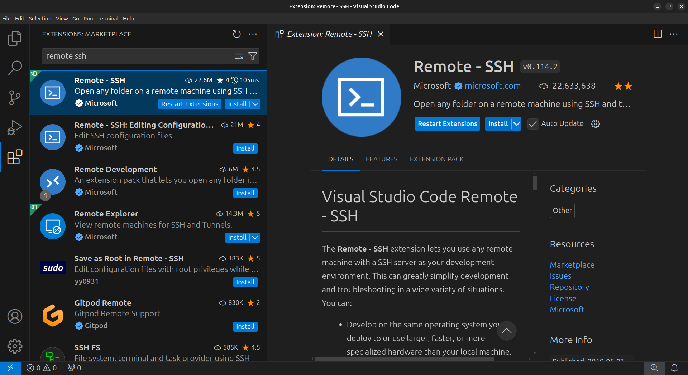
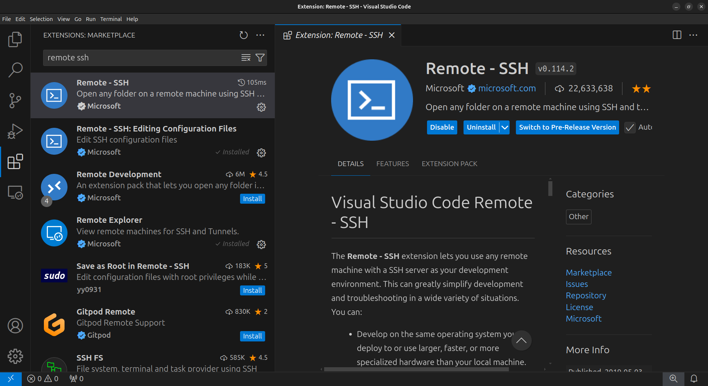
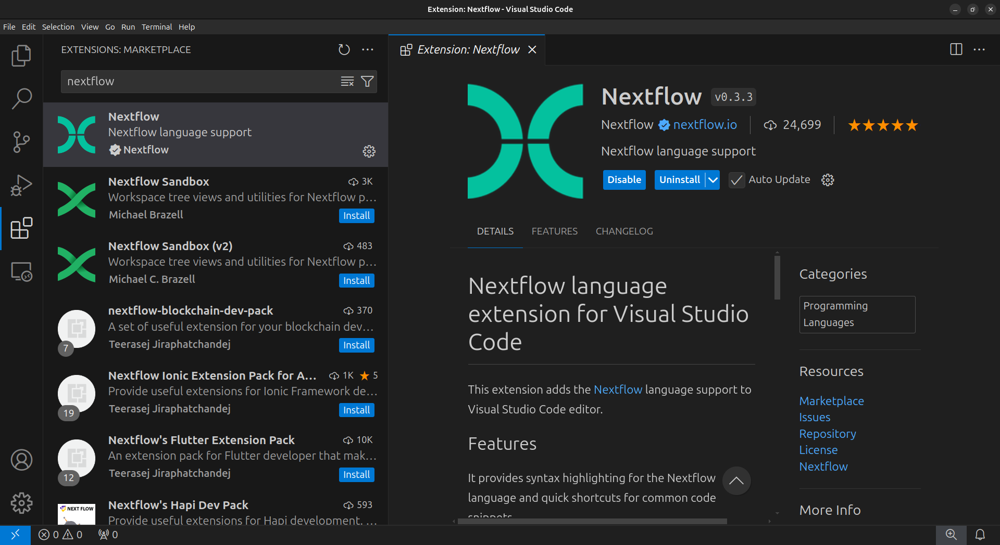
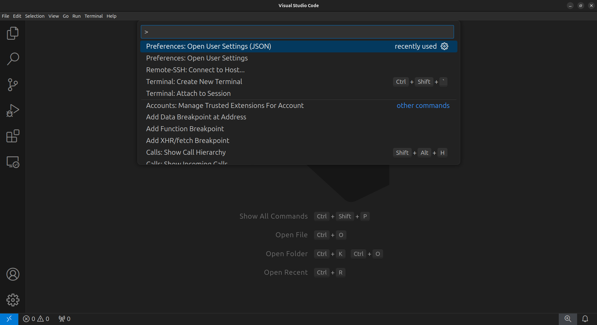
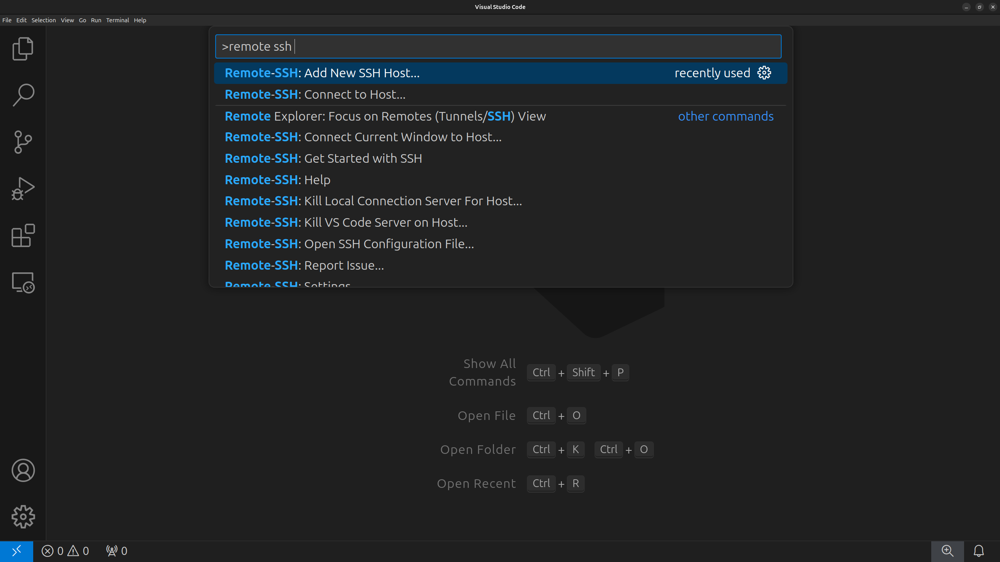
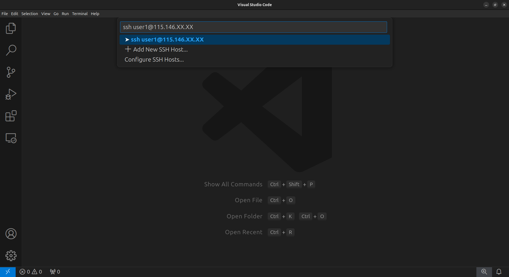

# Setting up your computer

In this workshop, we will be using Virtual Machines (VM) on the
[ARDC Nectar Research Cloud](https://ardc.edu.au/services/ardc-nectar-research-cloud/).

The requirements for this workshop are a personal computer with:

- Visual Studio Code (VSCode)
- A web browser

Below, you will find instructions on how to set up VSCode and connect toyour VM.
Each participant will be provided with their instances IP address prior
to the workshop.

Before the workshop, you must have the following:

1. VSCode installed.
2. The necessary VSCode extensions installed.
3. Be able to connect to your VM.  

## Installing Visual Studio Code

Visual Studio Code (VSCode) is a versatile code editor that we will use for the
workshop. We will use VSCode to connect to the VM, navigate the directories,
edit, view and download files. 

1. Download VSCode by following the 
[installation instructions](https://code.visualstudio.com/docs/setup/setup-overview)
for your local Operating System.  
2. Open VSCode to confirm it was installed correctly.  

## Installing the VSCode extensions

Specific VSCode extensions are required to connect to the VM and make working
with Nextflow files easier (i.e. syntax highlighting).  

1. In the VSCode sidebar on the left, click on the extensions button (four
blocks).
2. In the Extensions Marketplace search bar, search for `remote ssh`. Select
**"Remote - SSH"**.

3. Click on the blue `Install` button.

4. Search for `nextflow` and install the **"Nextflow"** extension.  

5. Close the Extensions tab and sidebar

## Connect to the virtual machine

1. In VSCode, press `Ctrl+Shift+P` (`Command+Shift+P` on mac) to open the Command Palette.  
 

2. Type `remote ssh` and select **`Remote-SSH: Connect to Host...`**.

3. Enter the SSH connection string with the IP address that was provided to you. The connection string should look like **`ssh user1@XXX.XXX.XX.XX`**. Ensure that you replace the "XXX..." with your IP address. Press `Enter`.

A new VSCode window will open with a "Connecting.." message. Once successfully logged in, you should see a small green box in the bottom left corner of your screen.

> Add screenshot once VMs are online again

Finally, toggle the terminal in VSCode by pressing `Ctrl+j` (`Cmd+j` on mac).

> Add check for file explorer  
